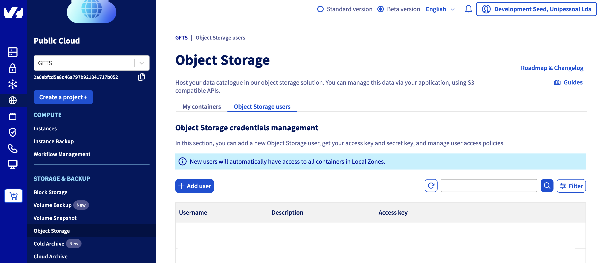
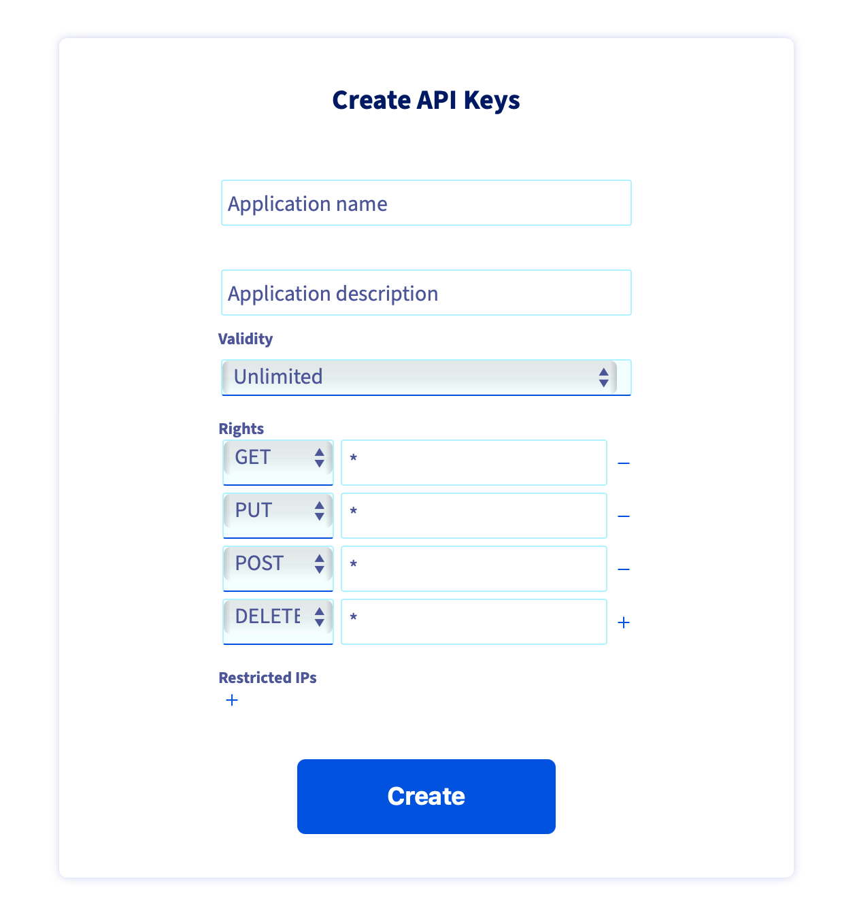
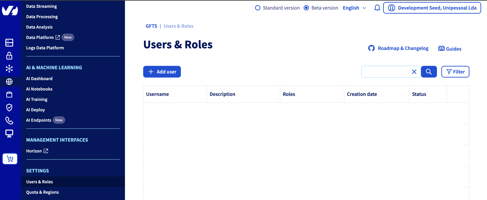

# Setup on OVH

In this section, we explain what you need to do to deploy JupyterHub on OVH. The deployment process is mostly automated, but a few steps must be completed on OVH before you can get started.

1. Go to OVH [https://www.ovh.com/](https://www.ovh.com/) and register if you do not have an account yet. Make sure to have sufficient credits to deploy and run your jupyterhub. 

2. For the automatic deployment to proceed, an existing S3 bucket on OVH is required, along with an admin user to manage it. In the Storage & Backup panel, select "Object storage" and create a new user (e.g. admin-terraform). 



Copy the credentials shown on the screen to `deploy/tf/secrets/ovh-creds.sh` in the AWS section (bear in mind that this file needs to be encrypted! we use vault to encrypt it): 

```
# source me to to set creds for deploying with tofu

# s3 creds for tf-state s3 backend storage
export AWS_ACCESS_KEY_ID=
export AWS_SECRET_ACCESS_KEY=

```
3. Then create a new bucket ("Create an object container"). Select "S3 compatible API", Select your deployment mode (e.g. 1-AZ Regions), select a region (In France or Germany e.g. Europe) and when asked to link a user, select the newly created admin user. Finally select a name for the bucket and click on "Create the container". 

4. Get the name of the bucket and report in `maint.tf`:

```bash
 # store state on gcs, like other clusters
  backend "s3" {
    bucket                      = "tf-state-gfts"
    key                         = "terraform.tfstate"
    region                      = "gra"
    endpoint                    = "s3.gra.io.cloud.ovh.net"
    skip_credentials_validation = true
    skip_region_validation      = true
  }
```


5. Go to [https://eu.api.ovh.com/createToken/](https://eu.api.ovh.com/createToken/) and generate a new API key for "GET, PUT, POST and DELETE" (see image below).



The API keys need to be stored in `deploy/tf/secrets/ovh-creds.sh` in the OVH variable section:

```
# ovh api creds for ovh provider
export OVH_APPLICATION_KEY=
export OVH_APPLICATION_SECRET=
export OVH_CONSUMER_KEY=
```

6. Create a terraform user. In the OVH interface, select "SETTINGS" section and "Users & Roles".



And create a new administrator user (select "Administrator" for the user role). Get the username and password of this newly created (administrator) user and add the credentials in `deploy/tf/secrets/ovh-creds.sh` in the Openstack section (`OS_`). 

```bash
# openstack credentials or terraform-deploy user
export OS_USERNAME="user-"
export OS_PASSWORD="XXXXX"
```


